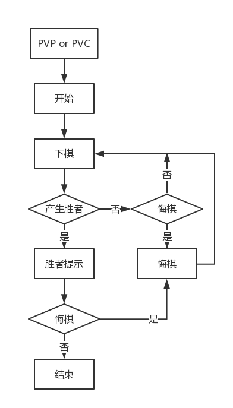
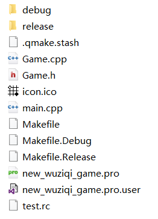
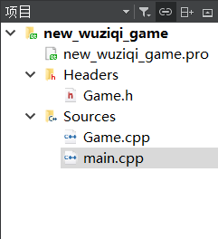
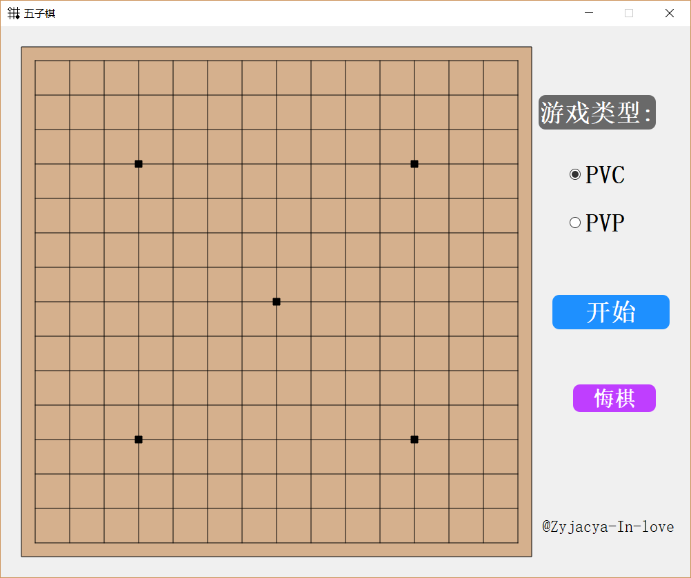
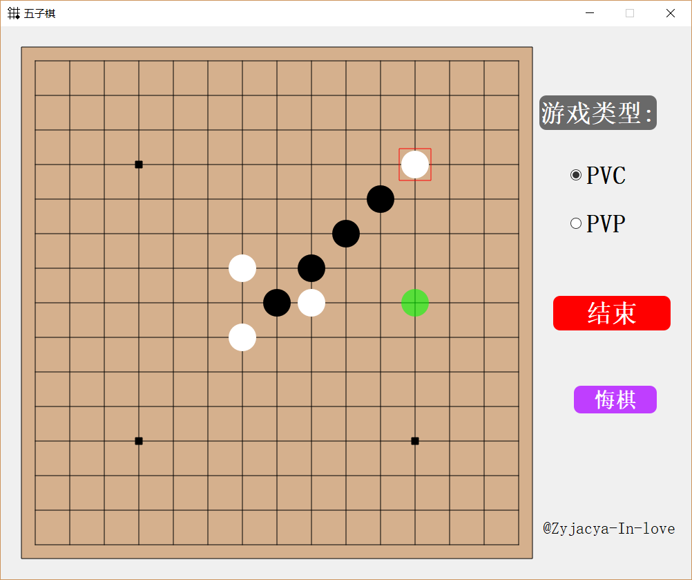
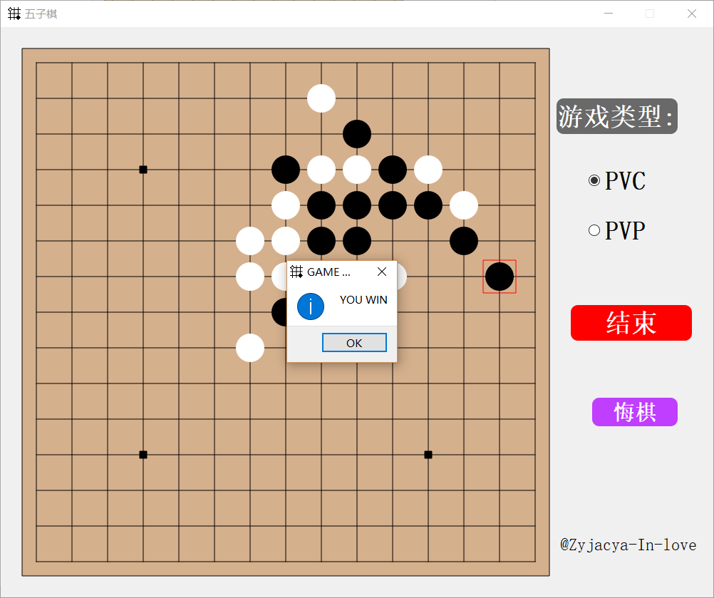
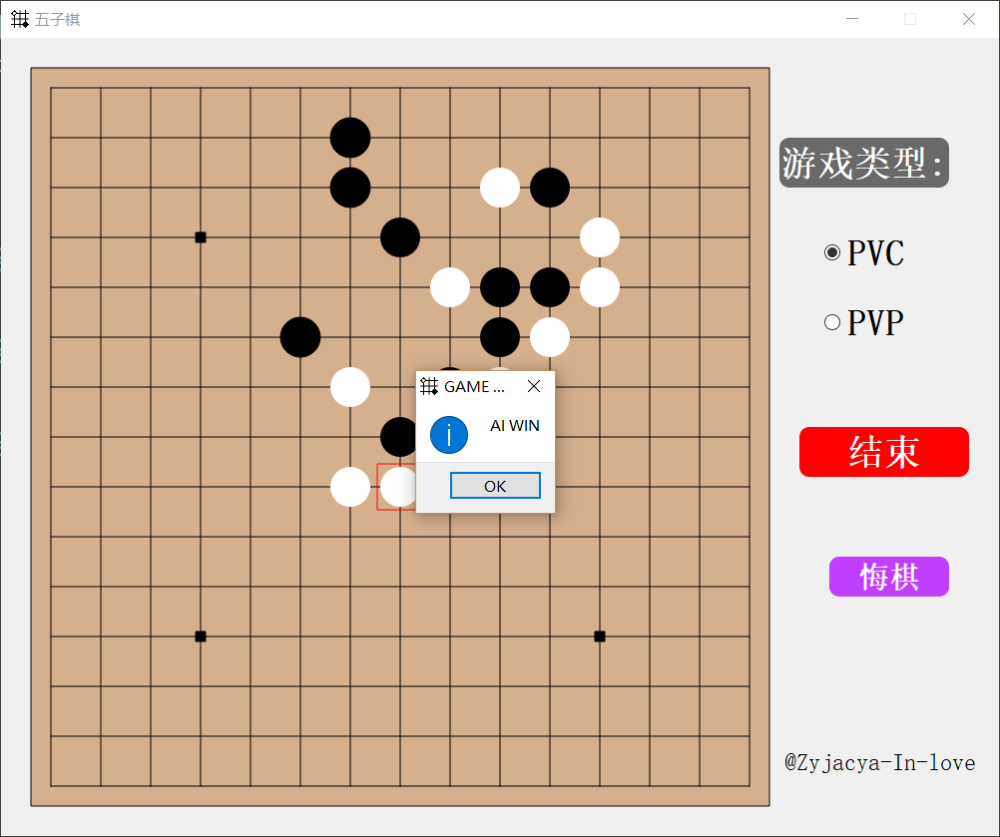
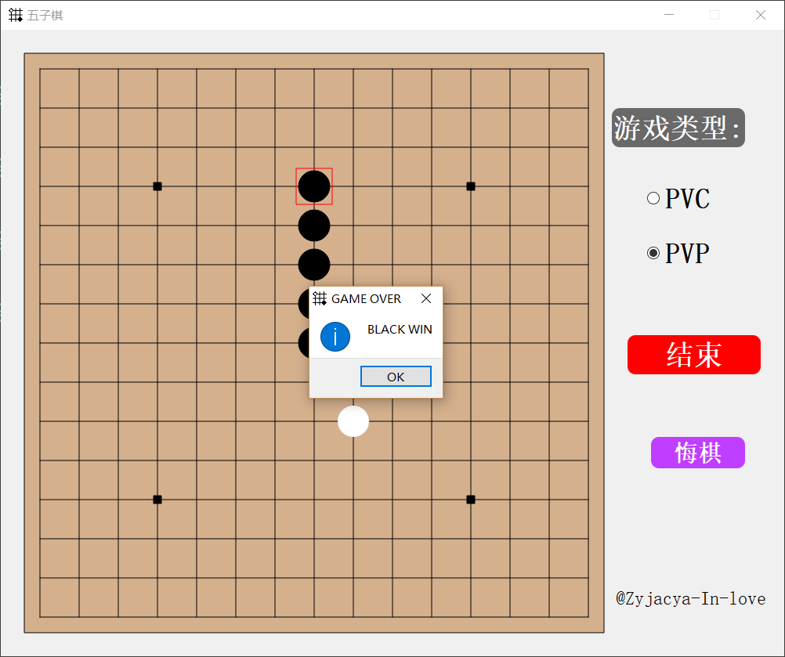
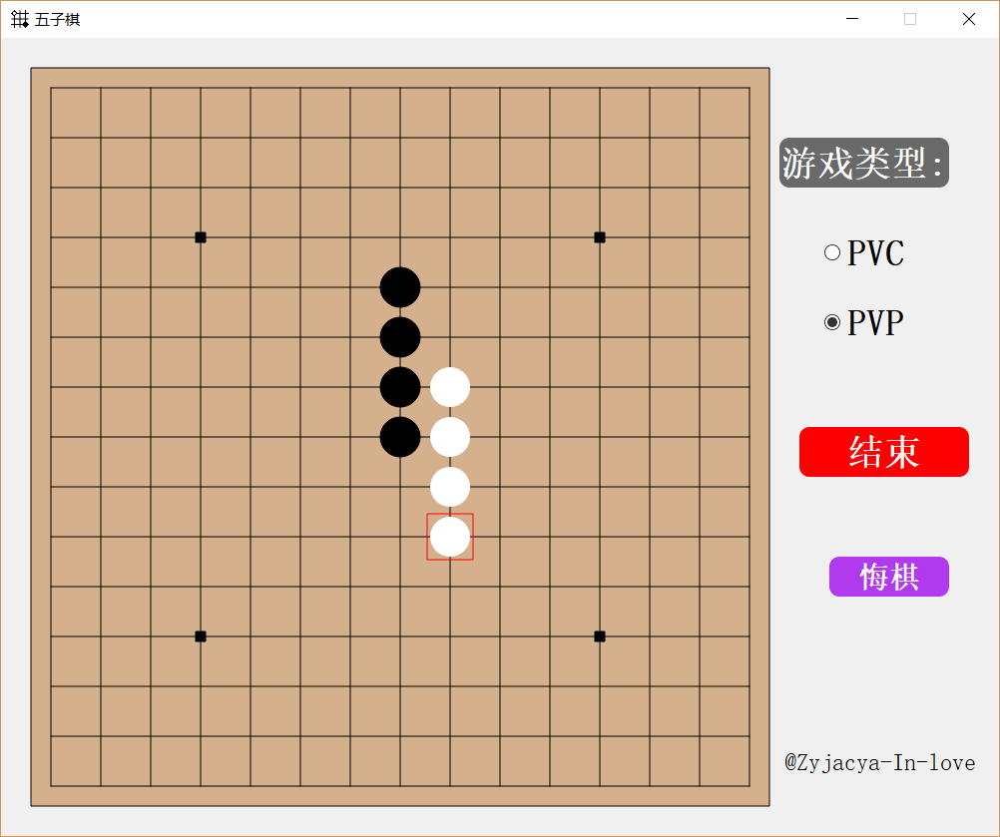

# Qt C++ : Gobang(五子棋)
## 目录：
<!-- MarkdownTOC -->

1. [一. 概述](#一-概述)
1. [二. 开发环境与开发工具](#二-开发环境与开发工具)
1. [三. 功能简介](#三-功能简介)
1. [四. 设计思路](#四-设计思路)
    1. [4.1 总体思路](#41-总体思路)
    1. [4.2 具体实现](#42-具体实现)
    1. [4.3 AI 算法](#43-ai-算法)
1. [五. 运行测试及结果](#五-运行测试及结果)
    1. [游戏界面](#游戏界面)
    1. [开始之后效果](#开始之后效果)
    1. [玩家赢棋](#玩家赢棋)
    1. [AI 赢棋](#ai-赢棋)
    1. [PVP获胜](#pvp获胜)
    1. [悔棋](#悔棋)
1. [结论与展望](#结论与展望)
    1. [结论](#结论)
    1. [不足之处及未来展望](#不足之处及未来展望)

<!-- /MarkdownTOC -->

## 一. 概述
使用 *Qt* 嵌 *C++* 编写的一个"五子棋"游戏，实现两方对弈。一方执白棋，一方执黑棋，先形成5 子连线者获胜。

总体模块上分为两部分

1. 人机对战 (PVC模式)
2. 人人对战 (PVP模式)

本项目实现了评分表的AI，可以做到人机对战，**未实现**局域网内二人对战（以后可能会补上）二人对战框架已经写好，只差socket编程部分

## 二. 开发环境与开发工具
- 开发语言：C++、Qt
- 开发工具：Qt Creator、sublime Text 3
- 开发环境：Windows 10
- 编译环境：MINGW version 5.3.0

## 三. 功能简介
1.  在画面中绘制一个14*14 棋盘
2.  黑白棋轮流下棋
3.  自动判定输赢，先形成5 子连线者获得胜利
4.  其中一方胜出弹出提示信息
5.  移动鼠标，光标处标识将要落子的位置
6.  最近一个落子用红框标识
7.  在线条交叉处单击鼠标，可以实现黑棋或白棋的绘制
8.  悔棋功能（附加即使游戏结束也能悔棋的功能）
9.  设置开始，结束按钮，单击即可开始或结束游戏
10. 游戏开始前，产生胜负后，锁定棋盘
11. 设置人人对战，人机对战双模式选择
12. 实现人与电脑的对弈

## 四. 设计思路

### 4.1 总体思路

<!--  -->

首先选择模式，PVP 或者是 PVC ，程序设定默认选项是 PVC 。然后单击开始按钮即可开始游戏，为了防止用户错误操作等其他不可预料的情况，开始前棋盘将被锁住，不能进行任何操作。然后双方下棋，每落一子，判定是否产生胜者。没有就继续下棋，如果点击悔棋按钮PVP模式就去掉前一个人的落子，如果使PVC模式就取消人及AI的落子。反之如果产生胜者游戏结束，并给出提示信息。游戏结束也可以悔棋。如果单击结束按钮，则更新棋盘为空，恢复初始状态。

<!--  -->

说明：main.cpp 是本项目的主程序文件，通过main程序调用 Game.cpp 中的类。Game.h 是 Game.cpp 的头文件，里面的内容是 Game.cpp 中类及函数的声明，Game.cpp 实现了 Game.h 中的声明。 icon.ico 是本程序的图标， test.rc 实现将图标导入程序。可执行文件存在于 release 目录中。

### 4.2 具体实现
简析 Game.h 本程序只有一个 Game 类，他继承 Qt 中的 QMainWindow ，以此来实现图形化界面。设定私有成员 chessboard[][] 存储棋盘当前状态，player 为当前下棋的一方，lock 为开始结束时的棋盘锁，game_type 是当前游戏的模式类型，button 为开始结束键， SelectModeGroup 是选择模式的按钮组，winner为游戏的胜利者。本程序通过栈来实现悔棋。

实现具体功能所需的方法，模块：我使用Game 的构造函数构建了游戏的窗口布局，按钮等。并设置了鼠标的监听。设置 update_chessboard 方法用用于当有人落子时更新棋盘。每一落子使用 Is_Someone_Win 方法判断是否有一方已经胜利。重载 Qwidget 中的 paintEvent ，mouseMoveEvent ，mousePressEvent 方法。分别用于更新图形化的棋盘，得到鼠标移动位置，绘制绿圆标识，以及判断鼠标按压位置，绘制棋子。以及每个按钮的槽函数。最后的就是 AI 下棋方法，人下棋方法。

### 4.3 AI 算法
五子棋 AI 的算法设计有很多，本程序采用的是评分表的方法。评分表算法其实是一种贪心算法。其基本思想是遍历棋盘，针对每个空白位子，计算该位子的评分值，最后找到具有最大评分值的位置落子。

那么显然，评分表算法最关键的就是进行着棋估值，因为估值方法，是教会电脑判断如何根据当前棋盘形式，找到最适合的着棋位置的关键。其直接决定了 AI 的获胜概率。

那么如何进行着棋估值呢？

首先根据上述思路对问题进行分析，即将问题解析成目标。对本题来说即是：给定棋盘上的一个点，求该点在当前棋局下的权值。并且若在该点落子后更容易接近胜利，则该点权值就高，越接近5子相连，权值越高。

根据上述分析，若要实现目标，有如下三个问题需要解决：

1.  方向问题：每个点有8个方向可以连子
2.  棋型判定：每个方向上有多种连子棋型，如活四、活三、死三等
3.  归属分析：当前棋型是己方还是对方达到

对于后两个问题可以这样思考，首先活四与活三的权值自然不同。然而同样是活三，己方的活三与对方的活三权值也应该不同，这样才能实现攻守的策略。假如现在棋局上同时有己方的活三和对方的活三，此时轮到己方落子，则正常情况下应当在己方活三上落子，使之成为活四，从而获胜。所以计算机在判断棋局时，遇到己方活三，权值应当较高，遇到对方活三，权值应当较低。

评分算法：针对某个空白位，往周围八个方向延伸，记录 人 \ AI 连成线的子及空白位的个数，以此来判断棋型。（棋型权值顺序：连五 > 活四 > 死四 > 活三 > 死三 > 活二 > 其他棋型）最后根据连成线的子个数和空白位的个数所得到的棋型给当前计算的空白位置加分。

AI 算法思路：先从 AI 的角度即进攻的角度寻找最大权值的位置，再从人即防守的角度寻找最大权值的位置并比较。如果进攻的权值更大，那么采取进攻策略，反之，采取防守策略。也就是说尽量遏制玩家，并且保持AI自身的进攻。

## 五. 运行测试及结果

### 游戏界面

### 开始之后效果

### 玩家赢棋

### AI 赢棋

### PVP获胜

### 悔棋

## 结论与展望

### 结论
以Qt嵌C++的方式使用面向对象的思想实现了五子棋游戏的基本功能，且界面比较美观，一些人性化的设计使得使用本程序能有较好的人机交互体验。

### 不足之处及未来展望
本次五子棋游戏还有些不足之处，没有实现先手选择，下棋时间限定，通过网络在不同客户端对弈和用户注册以及历史记录等常用功能。AI 算法没有写出更智能的博弈树 + α-β剪枝算法，只用评分表简单判断，使得 AI 不够智能，一些复杂的情况便无法判定做出最优解。

以后可能会填坑吧